# 📘 TÀI LIỆU NGUYÊN TẮC & HƯỚNG DẪN: XỬ LÝ DỮ LIỆU & ĐỒNG BỘ GITHUB OTA CHO VIETHUD

> **Dành cho:** Nhà phát triển (Developer) và Trợ lý AI (Claude / Gemini / GPT)  
> **Mục đích:** Ghi nhớ và tuân thủ tuyệt đối các nguyên tắc, đặc tả cấu trúc nhị phân, quy trình xử lý dữ liệu và cơ chế OTA qua GitHub cho hệ thống VietHUD.

---

## 1. TỔNG QUAN KIẾN TRÚC & TRIẾT LÝ HỆ THỐNG

VietHUD là thiết bị cảnh báo giao thông và bản đồ tốc độ **hoàn toàn ngoại tuyến (100% Offline Standalone)** chạy trên vi điều khiển **ESP32-S3 (16MB Flash, 8MB PSRAM)**:
- **Zero Cloud Latency khi lái xe:** Khi xe vận hành, thiết bị không cần 4G/Internet, toàn bộ việc định vị, so khớp bản đồ (Map Matching) và phát cảnh báo giọng nói tiếng Việt được thực hiện từ dữ liệu nhị phân nén trên thẻ nhớ MicroSD.
- **OTA Cloud Sync khi dừng xe:** Khi có kết nối Wi-Fi (qua Hotspot điện thoại hoặc Wi-Fi nhà), thiết bị có khả năng tự động đồng bộ bản đồ và danh sách camera phạt nguội mới nhất từ kho lưu trữ **GitHub** mà không cần tháo thẻ nhớ cắm vào máy tính.

---

## 2. ĐẶC TẢ CẤU TRÚC DỮ LIỆU NHỊ PHÂN (BINARY FORMAT SPECIFICATION)

> [!IMPORTANT]
> Tất cả các struct nhị phân phải tuân thủ chuẩn Little-Endian (`<`) và khớp chính xác 100% với file header C++ của firmware: `src/map/SpeedMapFormat.h`. Tuyệt đối không thay đổi kích thước byte (padding/alignment) của các struct này.

### 2.1. Cấu trúc Camera phạt nguội (`cameras.bin`)
- **Vị trí lưu trữ:** `/speedmap/cameras.bin`
- **Bộ nhớ nạp:** Load toàn bộ vào **PSRAM** khi khởi động để tra cứu tốc độ cao.
- **Định dạng struct C++:**
  ```cpp
  // Kích thước cố định: 20 bytes/record
  struct CameraRecord {
      uint64_t id;         // 8 bytes: Định danh duy nhất của camera
      int32_t  lat_e7;     // 4 bytes: Vĩ độ nhân 1e7 (ví dụ 21.028511 -> 210285110)
      int32_t  lon_e7;     // 4 bytes: Kinh độ nhân 1e7 (ví dụ 105.854444 -> 1058544440)
      int16_t  heading;    // 2 bytes: Hướng camera quan sát (0..359 độ, -1 nếu bắt mọi hướng)
      uint8_t  speed_limit;// 1 byte:  Tốc độ giới hạn (km/h, 0 nếu chỉ phạt nguội/đèn đỏ)
      uint8_t  cam_type;   // 1 byte:  Loại camera (1: Tốc độ, 4: Phạt nguội, 6: Đèn đỏ)
  } __attribute__((packed));
  ```
- **Định dạng Python Struct:** `"<QiihBB"` (Đúng 20 bytes).

### 2.2. Cấu trúc Biển báo giao thông (`signs.bin`)
- **Vị trí lưu trữ:** `/speedmap/signs.bin`
- **Cấu trúc File:** Gồm 1 khối **Header (20 bytes)** + Danh sách các **SignRecord (20 bytes/record)**.
- **Header Định dạng:**
  ```cpp
  struct SignHeader {
      char     magic[4];   // "VNSG" (0x56 0x4E 0x53 0x47)
      uint16_t version;    // Version 1
      uint32_t count;      // Tổng số lượng biển báo trong file
      uint16_t reserved;   // Dự phòng (0)
      uint32_t timestamp;  // Unix timestamp lúc biên dịch dữ liệu
      uint32_t checksum;   // CRC32 hoặc checksum kiểm tra toàn vẹn
  } __attribute__((packed)); // Đúng 20 bytes, Python struct: "<4sHIHII"
  ```
- **Record Định dạng:**
  ```cpp
  struct SignRecord {
      uint32_t id;         // 4 bytes: ID biển báo
      int32_t  lat_e7;     // 4 bytes: Vĩ độ * 1e7
      int32_t  lon_e7;     // 4 bytes: Kinh độ * 1e7
      uint16_t heading;    // 2 bytes: Hướng di chuyển hiệu lực (0..359)
      uint8_t  type;       // 1 byte:  TrafficSignType enum
      uint8_t  value;      // 1 byte:  Giá trị biển báo (vd: tốc độ 60, 80)
      uint8_t  zone_type;  // 1 byte:  1: Vào khu vực (Start), 2: Hết khu vực (End)
      uint8_t  flags;      // 1 byte:  Cờ bổ trợ
      uint16_t lookahead;  // 2 bytes: Khoảng cách cảnh báo kiến nghị (mét)
  } __attribute__((packed)); // Đúng 20 bytes, Python struct: "<IiiHBBBBH"
  ```
- **Enum TrafficSignType:**
  * `0`: Unknown
  * `1`: `SIGN_TYPE_SPEED_LIMIT` (Giới hạn tốc độ)
  * `2`: `SIGN_TYPE_RESIDENT_AREA` (Khu đông dân cư R.420 / R.421)
  * `3`: `SIGN_TYPE_NO_OVERTAKING` (Đoạn đường cấm vượt P.125 / DP.133)
  * `4`: `SIGN_TYPE_CAMERA` (Camera giao thông)
  * `5`: `SIGN_TYPE_TOLL_BOOTH` (Trạm thu phí BOT P.135)
  * `6`: `SIGN_TYPE_TRAFFIC_LIGHT` (Đèn tín hiệu giao thông)
  * `10`: `SIGN_TYPE_DANGER_OTHER` (Lối vào cao tốc / Hầm / Trạm dừng / Cầu hẹp)

### 2.3. Mạng lưới đường Vector (Vector Road Network)
Gồm 5 file phối hợp để hiển thị tên đường và tính giới hạn tốc độ hiện tại của cung đường:
1. `tiles.bin`: Chứa các phân đoạn đường vector chi tiết theo từng ô (Spatial Grid).
2. `index.bin`: Lưới chỉ mục không gian giúp vi điều khiển định vị tức thì ô tile cần nạp theo tọa độ GPS.
3. `metadata.bin`: Khung chữ nhật bao bọc tọa độ (Bounding Box) của bản đồ Việt Nam.
4. `names.bin`: Từ điển chuỗi ký tự tên đường phố.
5. `seg_names.bin`: Bảng ánh xạ giữa ID phân đoạn đường và offset tên phố trong `names.bin`.

### 2.4. Thư viện âm thanh giọng nói (`sounds/`)
Thư mục `/speedmap/sounds/` chứa các file âm thanh giọng nói tiếng Việt chuẩn MP3 bitrate thấp tối ưu cho ESP32 (`ESP8266Audio` I2S):
- Cảnh báo tốc độ: `speed/50.mp3`, `speed/60.mp3`, `speed/80.mp3`, `speed/100.mp3`, ...
- Cảnh báo biển báo: `batdaukhudancu.mp3`, `hetkhudongdancu.mp3`, `camvuot.mp3`, `hetcamvuot.mp3`, `speedcamera.mp3`, `tramthuphi.mp3`, `chuydentinhieugiaothong.mp3`, `sapdencuaham.mp3`.

---

## 3. QUY TRÌNH XỬ LÝ & LÀM SẠCH DỮ LIỆU TRÊN PC (DATA PIPELINE)

Toàn bộ công cụ xử lý đặt tại thư mục: `C:\Users\phamq\Downloads\Data\`.

```mermaid
flowchart LR
    A[Dữ liệu thô OSM / CSVs] --> B[viethud_builder.py]
    B -->|Lọc hình nón & Khử trùng lặp| C[Làm sạch & Nén nhị phân]
    C --> D[VietHUD_SDCard_Ready/speedmap]
    D -->|push_to_github.py| E[Sinh manifest.txt & Push Git]
    E --> F[GitHub Cloud Repository]
    F -->|Wi-Fi OTA| G[Thiết bị VietHUD ESP32]
```



### 3.1. Thuật toán khử trùng lặp (Spatial Deduplication)
Do dữ liệu thu thập từ nhiều nguồn (OpenStreetMap, cộng đồng lái xe, trích xuất VietMap/WYN) có thể chứa các điểm camera hoặc biển báo bị trùng tọa độ hoặc lệch vài mét, thuật toán làm sạch bắt buộc áp dụng tiêu chí sau:
- **Khoảng cách không gian (Haversine Distance):** Nếu khoảng cách giữa 2 điểm $\le 10\text{ mét}$.
- **Góc hướng quan sát (Heading Delta):**
  $$\Delta \text{Heading} = \min(|H_1 - H_2|,\, 360^\circ - |H_1 - H_2|) \le 45^\circ$$
- **Hành vi xử lý:** Gộp điểm (merge), giữ lại thông tin có độ tin cậy cao nhất (ưu tiên biển báo có tốc độ cụ thể và nguồn chính xác), loại bỏ điểm thừa.

### 3.2. Cấu trúc thư mục đầu ra chuẩn cho Thẻ nhớ MicroSD
Khi chạy script build xong, thư mục kết quả bắt buộc phải là:  
`C:\Users\phamq\Downloads\Data\VietHUD_SDCard_Ready\speedmap\`
Chứa toàn bộ các file `.bin`, `sounds/` và file tra cứu `combined_traffic_alerts.csv`. Dung lượng gói Vector tối giản chỉ khoảng **16.6 MB**.

---

## 4. QUY TRÌNH & NGUYÊN TẮC ĐỒNG BỘ GITHUB OTA

### 4.1. Repository GitHub & Cấu trúc thư mục Cloud
- **Repository URL:** `https://github.com/911273/VietHUD.git`
- **Nhánh (Branch):** `main`
- **Cấu trúc cây thư mục trên GitHub:**
  ```text
  VietHUD/
  ├── README.md               <-- Trang giới thiệu, bảng kiểm kê file và hướng dẫn cấu hình
  └── speedmap/               <-- Thư mục gốc chứa dữ liệu thiết bị sẽ tải
      ├── manifest.txt        <-- File quan trọng nhất: Danh mục phiên bản và mã băm
      ├── cameras.bin
      ├── signs.bin
      ├── tiles.bin
      ├── index.bin
      ├── metadata.bin
      ├── names.bin
      ├── seg_names.bin
      └── sounds/             <-- Toàn bộ thư viện file MP3 cảnh báo tiếng Việt
  ```

### 4.2. Định dạng chuẩn của `manifest.txt`
Firmware VietHUD (`DataUpdater.cpp`) đọc file `manifest.txt` theo định dạng text cực kỳ khắt khe:

```text
version 2026.09.25.1049
cameras.bin 1206920 b8f4538e1659a3d772a6d0714a7e1aeaf1335285e232307af31211ee1a9656b0
signs.bin 1869480 446c57d3a608f954a5117d6a236fc770021333d16e38ccbac933c6d9d1a5b84a
tiles.bin 5102776 ff41ca79e36916ca8ac2b82965818f750c799316e758ccb718ce01322d9e7f62
index.bin 96236 25656be57c8a9b9b9d411df84477f4eaa79998adb4554ea648c356bc34f16d33
metadata.bin 140 f6beebdf94259322e93e9e60ad056ac832c9396acd23a0337cd1c79c56ffed0e
names.bin 144563 6edd2dc0859dc9b524c60645deade49cc9a50741222212fdb487d3c5e74cd62f
seg_names.bin 364486 d210aeeece6f42133ac01aa500dae393220c16296731bfca8cf785528bfdc6ae
```

**Quy tắc định dạng `manifest.txt`:**
1. Dòng đầu tiên: Bắt đầu bằng từ khóa `version ` kèm theo chuỗi phiên bản dạng `YYYY.MM.DD.HHMM`.
2. Mỗi dòng dữ liệu gồm đúng 3 trường cách nhau bằng dấu cách:
   `<tên_file> <kích_thước_byte> <mã_băm_sha256_chữ_thường>`
3. **Giới hạn số lượng file:** Firmware định nghĩa `#define DU_MAX_FILES 24`. Tuyệt đối **không được vượt quá 24 file** trong `manifest.txt` (bộ nhớ stack/PSRAM trên ESP32 cấp phát tĩnh theo số lượng này).
4. **Không đưa file ảnh Raster 448MB (`maptiles.bin`) vào manifest:** Hệ thống OTA chỉ phục vụ dữ liệu vector và camera (~16MB). File raster quá lớn, tải qua Wi-Fi ESP32 sẽ gây tràn bộ nhớ hoặc rớt kết nối.

### 4.3. URL cấu hình OTA trực tiếp trên VietHUD
Khi thiết bị gửi yêu cầu HTTP GET, nó sẽ tải trực tiếp từ GitHub CDN (Fastly) thông qua tiền tố `raw.githubusercontent.com`:
```text
https://raw.githubusercontent.com/911273/VietHUD/main/speedmap/
```
- Khi kiểm tra phiên bản: Thiết bị ghép chuỗi thành:  
  `https://raw.githubusercontent.com/911273/VietHUD/main/speedmap/manifest.txt`
- Khi tải file thành phần: Thiết bị ghép chuỗi thành:  
  `https://raw.githubusercontent.com/911273/VietHUD/main/speedmap/cameras.bin`, v.v.

### 4.4. Cơ chế cập nhật nguyên tử (Atomic Update) trên Thẻ nhớ
Firmware VietHUD đảm bảo an toàn 100% cho dữ liệu thẻ nhớ:
1. Mỗi file tải về sẽ được ghi vào file tạm có đuôi `.tmp` (ví dụ `/speedmap/cameras.bin.tmp`).
2. Trong quá trình ghi, luồng dữ liệu được băm trực tiếp qua thư viện phần cứng `mbedtls_sha256_update`.
3. Chỉ khi file tải xong hoàn chỉnh và có SHA-256 trùng khớp 100% với `manifest.txt`, firmware mới xóa file cũ và đổi tên file `.tmp` thành file chính.
4. Nếu mất mạng hoặc xe tắt máy giữa chừng, dữ liệu cũ trên thẻ nhớ vẫn hoàn toàn nguyên vẹn, không bị hỏng thẻ nhớ (Corrupted SD Card).

---

## 5. BỘ QUY TẮC BẤT DI BẤT DỊCH CHO CLAUDE & NHÀ PHÁT TRIỂN

Khi nhận bất kỳ yêu cầu nào liên quan đến sửa đổi code builder, thêm tính năng dữ liệu hoặc chỉnh sửa firmware VietHUD, Claude **PHẢI TUÂN THỦ NGHIÊM NGẶT 7 NGUYÊN TẮC SAU**:

1. **Nguyên tắc 1 - Bảo toàn cấu trúc nhị phân:**
   Tuyệt đối không tự ý thêm, bớt hoặc đảo vị trí các trường trong `CameraRecord` (20B), `SignRecord` (20B), `SignHeader` (20B). Nếu thay đổi một byte bất kỳ, firmware ESP32-S3 sẽ giải mã sai toàn bộ vị trí kinh độ/vĩ độ và gây treo máy (`LoadProhibited`).
2. **Nguyên tắc 2 - SHA-256 chuẩn chữ thường:**
   Tất cả mã băm trong `manifest.txt` phải được chuyển sang dạng chuỗi hexa chữ thường (`hexdigest().lower()`) để hàm `strcasecmp` / `strcmp` trên vi điều khiển so khớp chính xác.
3. **Nguyên tắc 3 - Giới hạn 24 file trong Manifest:**
   Không liệt kê hàng trăm file MP3 riêng lẻ vào `manifest.txt`. Nếu cần cập nhật âm thanh qua OTA, phải đóng gói thành file lưu trữ nhị phân duy nhất (ví dụ `sounds.bin`) hoặc chỉ cập nhật 7 file vector cốt lõi.
4. **Nguyên tắc 4 - Tách bạch Thư mục SD Card và Thư mục Git Staging:**
   - Thư mục `VietHUD_SDCard_Ready\speedmap\` là thư mục chuẩn để copy thủ công vào thẻ nhớ.
   - Thư mục `VietHUD_Git_Staging\` là thư mục làm việc của Git để push lên GitHub.
   Không để các file ẩn `.git` lọt vào thẻ nhớ MicroSD vì có thể gây chậm thời gian quét thư mục của vi điều khiển.
5. **Nguyên tắc 5 - Chuẩn mã hóa UTF-8 trên Windows:**
   Tất cả các script Python và batch file khi chạy trên console Windows phải khai báo `chcp 65001 > nul` và `sys.stdout.reconfigure(encoding='utf-8')` để không bị lỗi ký tự tiếng Việt khi in tên đường phố.
6. **Nguyên tắc 6 - Tránh sử dụng bộ nhớ nội RAM cho Buffers:**
   Trên ESP32-S3, dung lượng SRAM nội bị chia sẻ lớn cho Wi-Fi Stack và TLS Engine. Mọi mảng buffer tạm để download file trên 2KB phải được cấp phát trong **PSRAM** (`MALLOC_CAP_SPIRAM`).
7. **Nguyên tắc 7 - Luôn hỗ trợ Follow Redirects:**
   Khi chỉnh sửa `DataUpdater.cpp` trên ESP32, đối tượng `HTTPClient` phải luôn bật cấu hình `http.setFollowRedirects(HTTPC_FORCE_FOLLOW_REDIRECTS)` và `sclient.setInsecure()` để tương thích hoàn toàn với cơ chế chuyển hướng CDN của GitHub HTTPS.

---

## 6. HƯỚNG DẪN THỰC THI NHANH (CHEATSHEET)

### 1. Khi có dữ liệu mới trên máy tính (CSV / OSM):
Chỉ cần chạy 1 trong 2 file sau trong thư mục `C:\Users\phamq\Downloads\Data\`:
- Nhấp đúp **`VIETHUD_UPDATE_TOOL.bat`** $\to$ Chọn `[4] DONG GOI VA DAY LEN GITHUB`
- Hoặc nhấp đúp trực tiếp **`PUSH_TO_GITHUB.bat`**

### 2. Khi muốn cập nhật cho thiết bị VietHUD trên xe:
1. Bật điểm phát sóng Wi-Fi (Personal Hotspot) trên điện thoại.
2. Dùng điện thoại truy cập WebPortal của VietHUD (mặc định: `http://192.168.4.1`).
3. Dán URL: `https://raw.githubusercontent.com/911273/VietHUD/main/speedmap/` vào ô **Data Update URL** và nhấn **Lưu & Cập nhật ngay**.
4. Thiết bị tự động tải dữ liệu, ghi vào thẻ nhớ và khởi động lại trong vòng 30 - 60 giây.
