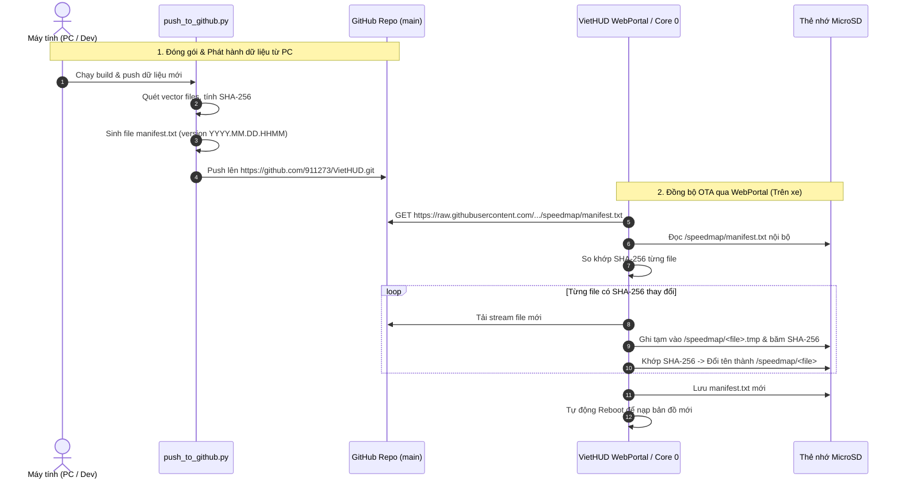

# 🌐 HƯỚNG DẪN & NGUYÊN TẮC KỸ THUẬT: WEBPORTAL & GITHUB OTA (VIETHUD)

> **Mục tiêu tài liệu:** Ghi nhớ và quy chuẩn toàn bộ kiến trúc, API, luồng dữ liệu và các nguyên tắc kỹ thuật bất biến của hệ thống **WebPortal trên vi điều khiển ESP32-S3** và **Hệ sinh thái đồng bộ GitHub OTA** cho thiết bị **VietHUD**.  
> **Đối tượng áp dụng:** Nhà phát triển (Developer) và Trợ lý AI (Claude / Gemini).

---

## 1. TỔNG QUAN KIẾN TRÚC KẾT NỐI



---

## 2. HỆ THỐNG WEBPORTAL TRÊN THIẾT BỊ VIETHUD (ESP32-S3)

Hệ thống WebPortal được triển khai trong hai file mã nguồn:
- Header & Trạng thái: `src/net/WebPortal.h` & `src/net/DataUpdater.h`
- Logic xử lý & Giao diện: `src/net/WebPortal.cpp` & `src/net/DataUpdater.cpp`

### 2.1. Chế độ mạng & Truy cập (Network Modes)
1. **Chế độ Access Point (AP Mode - Mặc định khi khởi động):**
   - **SSID:** `VietHUD-XXXX` (với `XXXX` là 4 ký tự cuối địa chỉ MAC).
   - **Mật khẩu AP:** Cấu hình trong `cfg.apPassword` (mặc định để trống hoặc theo cài đặt).
   - **Địa chỉ IP:** `192.168.4.1`
   - **Tên miền cục bộ (mDNS):** `http://viethud.local`
   - **Captive Portal (`DNSServer`):** Tự động mở trang chào khi smartphone kết nối vào Wi-Fi của VietHUD.
2. **Chế độ Station (STA Mode - Kết nối Internet):**
   - Kết nối vào Wi-Fi Hotspot của điện thoại (hoặc Wi-Fi nhà) để có Internet tải dữ liệu từ GitHub.
   - Cấu hình qua giao diện Web `/config` hoặc menu **Settings > WiFi** trên màn hình cảm ứng.

### 2.2. Danh sách Endpoints & API của WebPortal

| Phương thức | Đường dẫn URL | Chức năng | Dữ liệu truyền / nhận |
| :--- | :--- | :--- | :--- |
| `GET` | `/` | Trang chủ giám sát thời gian thực (Live Telemetry & Dashboard). Có nút **"Update data"** kích hoạt OTA. | HTML / CSS / JS giao diện tối ưu di động. |
| `GET` | `/api/status` | API trả về JSON trạng thái cảm biến, GPS, Wi-Fi và tiến trình tải cập nhật OTA. | `{"dataUpdate":{"state":1,"filesDone":2,"filesTotal":7,"percent":45,"msg":"Downloading tiles.bin"}}` |
| `POST` | `/api/action` | Kích hoạt tác vụ hệ thống (OTA data update, test âm thanh, bật/tắt demo). | Tham số POST: `action=dataupdate` |
| `GET` | `/config` | Giao diện cấu hình thiết bị: Wi-Fi STA SSID/Pass, độ sáng, và ô cấu hình `Data Update URL`. | HTML Form |
| `POST` | `/config` | Lưu cấu hình người dùng vào bộ nhớ flash NVS (`saveConfigToNVS()`). | Tham số POST: `dataUpdateUrl=...` |
| `GET` | `/update` | Trang cập nhật Firmware OTA (nạp file `firmware.bin` thủ công qua trình duyệt). | Form upload file nhị phân qua `Update.h`. |
| `POST` | `/update` | Xử lý nạp firmware nhị phân vào phân vùng flash OTA. | Multipart stream file |
| `GET` | `/triplog` | Xem và tải danh sách nhật ký hành trình lưu trên thẻ nhớ MicroSD. | HTML Table |

### 2.3. Trạng thái cập nhật dữ liệu (`DataUpdateState`)
Trạng thái được quản lý bởi enum trong `DataUpdater.h` và hiển thị trên Web qua `/api/status`:
* `DU_IDLE = 0`: Chưa chạy cập nhật hoặc đã hoàn thành từ lâu.
* `DU_RUNNING = 1`: Đang kiểm tra manifest hoặc đang tải file (kèm `%` tiến trình và tên file).
* `DU_SUCCESS = 2`: Cập nhật thành công (thiết bị đếm ngược 2.5 giây rồi khởi động lại).
* `DU_FAILED = 3`: Thất bại (lỗi kết nối, sai mã băm, không tải được manifest; dữ liệu cũ giữ nguyên).

---

## 3. QUY CHUẨN KHO LƯU TRỮ GITHUB & CƠ CHẾ CLOUD OTA

### 3.1. Thông số Kho lưu trữ GitHub
* **Repository URL:** `https://github.com/911273/VietHUD.git`
* **Nhánh phát hành:** `main`
* **Đường dẫn thư mục dữ liệu trên Git:** `/speedmap/`
* **URL tải trực tiếp (Fastly CDN Raw Base URL):**
  ```text
  https://raw.githubusercontent.com/911273/VietHUD/main/speedmap/
  ```

### 3.2. Cấu trúc cây thư mục chuẩn trên GitHub
```text
VietHUD/ (Root)
├── README.md               <-- Thông tin phiên bản, bảng băm SHA-256 và hướng dẫn người dùng
└── speedmap/               <-- Thư mục gốc thiết bị tải về
    ├── manifest.txt        <-- File mục lục phiên bản và danh sách mã băm
    ├── cameras.bin         <-- Vị trí camera phạt nguội & camera tốc độ
    ├── signs.bin           <-- Biển báo khu dân cư, cấm vượt, trạm thu phí
    ├── tiles.bin           <-- Mạng lưới đường vector chi tiết
    ├── index.bin           <-- Lưới chỉ mục không gian tra cứu nhanh
    ├── metadata.bin        <-- Bounding box và metadata bản đồ
    ├── names.bin           <-- Từ điển tên đường phố Việt Nam
    ├── seg_names.bin       <-- Ánh xạ phân đoạn đường sang tên phố
    └── sounds/             <-- Thư viện file âm thanh cảnh báo MP3 tiếng Việt
```

### 3.3. Đặc tả cấu trúc file `manifest.txt`
File `manifest.txt` bắt buộc phải tuân theo đúng cú pháp sau:
```text
version 2026.09.25.1049
cameras.bin 1206920 b8f4538e1659a3d772a6d0714a7e1aeaf1335285e232307af31211ee1a9656b0
signs.bin 1869480 446c57d3a608f954a5117d6a236fc770021333d16e38ccbac933c6d9d1a5b84a
tiles.bin 5102776 ff41ca79e36916ca8ac2b82965818f750c799316e758ccb718ce01322d9e7f62
index.bin 96236 25656be57c8a9b9b9d411df84477f4eaa79998adb4554ea648c356bc34f16d33
metadata.bin 140 f6beebdf94259322e93e9e60ad056ac832c9396acd23a0337cd1c79c56ffed0e
names.bin 144563 6edd2dc0859dc9b524c60645deade49cc9a50741222212fdb487d3c5e74cd62f
seg_names.bin 364486 d210aeeece6f42133ac01aa500dae393220c16296731bfca8cf785528bfdc6ae
```

**Quy tắc định dạng bất biến:**
1. **Dòng 1:** Bắt buộc có tiền tố `version ` theo sau là chuỗi phiên bản (thường dùng timestamp `YYYY.MM.DD.HHMM`).
2. **Các dòng tiếp theo:** Gồm đúng 3 giá trị phân tách bằng khoảng trắng:  
   `<tên_file> <dung_lượng_byte> <mã_sha256_chữ_thường>`
3. **Giới hạn số lượng file:** Firmware cấp phát tĩnh mảng `#define DU_MAX_FILES 24`. Tổng số dòng file trong manifest **không bao giờ được vượt quá 24 file**.
4. **Không đưa file Raster 448MB vào manifest:** OTA chỉ phục vụ tập dữ liệu Vector tối giản (~16MB). File raster `maptiles.bin` bị cấm đưa vào manifest.

---

## 4. BỘ CÔNG CỤ TỰ ĐỘNG HÓA TRÊN PC (DESKTOP AUTOMATION)

Các công cụ đặt tại thư mục: `C:\Users\phamq\Downloads\Data\`

1. **`push_to_github.py`** *(Script lõi Python)*:
   * Tự động quét các file vector trong `VietHUD_SDCard_Ready/speedmap/`.
   * Tính toán dung lượng và mã băm SHA-256 chuẩn cho từng file.
   * Tạo file `manifest.txt` đúng chuẩn firmware và file `README.md` hiển thị trên GitHub.
   * Sao chép vào thư mục `VietHUD_Git_Staging/` và gọi các lệnh Git (`init`, `remote add`, `add`, `commit`, `push -u origin main`).
2. **`PUSH_TO_GITHUB.bat`** *(File thực thi 1-Click)*:
   * Cho phép người dùng nhấp đúp để thực hiện toàn bộ quy trình đẩy dữ liệu lên GitHub mà không cần nhớ câu lệnh terminal.
3. **`VIETHUD_UPDATE_TOOL.bat`**:
   * Tích hợp tùy chọn `[4] DONG GOI VA DAY LEN GITHUB (OTA Cloud Update cho VietHUD)`.

---

## 5. BỘ QUY TẮC BẤT DI BẤT DỊCH DÀNH CHO CLAUDE & DEVELOPER

Khi bảo trì hoặc nâng cấp tính năng WebPortal và GitHub Sync, Claude **BẮT BUỘC TUÂN THỦ CÁC NGUYÊN TẮC SAU**:

### 🔴 Quy tắc về Firmware ESP32 & WebPortal:
1. **Không chặn Core 1 (UI Thread):**
   Tác vụ cập nhật dữ liệu (`dataUpdateTask`) **bắt buộc chạy trên Core 0 (PRO_CPU)** dưới dạng một FreeRTOS task riêng biệt. Tuyệt đối không gọi hàm tải file đồng bộ bên trong vòng lặp UI hay trong callback của web server.
2. **Bộ đệm tải phải nằm trong PSRAM:**
   Do stack Wi-Fi và SSL/TLS tiêu tốn phần lớn SRAM nội, tất cả buffer download (`dlBuf` 4KB, `remote` / `local` MFile struct) phải được cấp phát trên PSRAM bằng `heap_caps_malloc(..., MALLOC_CAP_SPIRAM)`.
3. **Cấu hình Client HTTPS bắt buộc:**
   Khi dùng `HTTPClient` để tải từ GitHub:
   - Phải gọi `sclient.setInsecure()` để bỏ qua việc lưu trữ Root CA cồng kềnh trong RAM.
   - Phải gọi `http.setFollowRedirects(HTTPC_FORCE_FOLLOW_REDIRECTS)` vì GitHub CDN luôn chuyển hướng URL (HTTP 301/302).
   - Thiết lập `http.setTimeout(15000)` tránh treo task khi mạng yếu.
4. **Cơ chế ghi file nguyên tử (Atomic Write):**
   Mọi file tải về phải ghi vào `<tên_file>.tmp`. Chỉ xóa file cũ và đổi tên sau khi toàn bộ file tải xong và mã SHA-256 trùng khớp 100%.

### 🔵 Quy tắc về Dữ liệu & GitHub Pipeline:
1. **Định dạng SHA-256 là Hex chữ thường (Lowercase):**
   Hàm băm trên PC phải xuất chuỗi hexa chữ thường (`hexdigest().lower()`) để hàm `strcasecmp` trên vi điều khiển hoạt động chính xác.
2. **Tách biệt Git Staging và SD Card Ready:**
   - Thư mục copy thẻ nhớ: `VietHUD_SDCard_Ready/speedmap/`
   - Thư mục làm việc Git: `VietHUD_Git_Staging/`
   Không để thư mục `.git` lọt vào thẻ nhớ MicroSD.
3. **Đường dẫn cấu hình trên VietHUD luôn có gạch chéo cuối (`/`):**
   URL cấu hình phải kết thúc bằng `/` (ví dụ: `.../main/speedmap/`). Firmware có cơ chế tự động bù `/`, nhưng luôn định dạng chuẩn để tránh lỗi ghép chuỗi.
