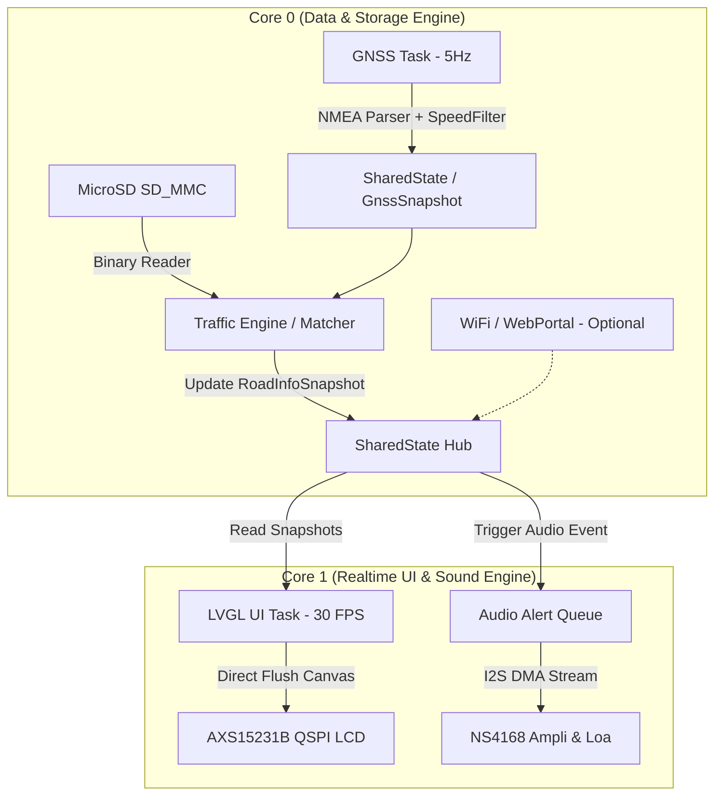

# Kế Hoạch Phát Triển Sản Phẩm: Thiết Bị Cảnh Báo Giao Thông & Tốc Độ GPS Offline (VietHUD)

## 1. Tổng Quan & Định Vị Sản Phẩm

### 1.1. Mục tiêu sản phẩm
Phát triển một thiết bị hỗ trợ lái xe thông minh độc lập (standalone), chuyên dụng, hoạt động **100% OFFLINE** trên nền tảng phần cứng sẵn có (Board **JC3248W535** - ESP32-S3 + Màn hình 3.5" + GNSS u-blox M10N + MicroSD + Loa I2S NS4168):
- **Hiển thị tốc độ xe GPS chuẩn xác**, mượt mà, không giật trễ nhờ thuật toán lọc số (Median + EMA filter).
- **Cảnh báo tốc độ giới hạn**: Nhận diện tốc độ quy định của đoạn đường đang chạy và báo trước biển báo tốc độ sắp tới (lookahead 100–300m).
- **Cảnh báo camera phạt nguội offline**: Phát hiện sớm camera giám sát tốc độ, camera phạt nguội vượt đèn đỏ, lấn làn (đếm ngược khoảng cách 300m, 200m, 100m, 50m).
- **Cảnh báo giao thông phong phú**: Bắt đầu / Hết khu đông dân cư (R.420 / R.421), Cấm vượt / Hết cấm vượt (P.125 / DP.133), Trạm thu phí (BOT), Trạm dừng chân, Khu vực nguy hiểm.
- **Phát giọng nói tiếng Việt tự nhiên**: Phát âm thanh trực tiếp qua chip ampli I2S NS4168 trên bo mạch với bộ file giọng đọc chuẩn.
- **Tiện lợi tối đa**: Khởi động tức thì (<2 giây), cắm tẩu sạc là chạy, không phụ thuộc điện thoại, không cần 4G, không lo nóng máy/chai pin điện thoại.

---

## 2. Đánh Giá Hiện Trạng & Khả Năng Kế Thừa Từ Nền Tảng Phần Cứng Hiện Có

| Hạng mục | Hiện trạng hiện có | Đánh giá & Khả năng tái sử dụng |
| :--- | :--- | :--- |
| **Phần cứng vi điều khiển** | ESP32-S3-N16R8V (Dual-core 240MHz, 16MB Flash, 8MB Octal PSRAM) | **Hoàn hảo**: Cực mạnh, 8MB PSRAM dư sức nạp toàn bộ danh mục biển báo & camera toàn quốc vào RAM. |
| **Màn hình & Cảm ứng** | AXS15231B 320x480 QSPI RGB565 + Touch I2C | **Đã hoàn thiện & kiểm chứng**: Driver hiển thị và LVGL đã chạy ổn định 33ms/frame, giao diện sắc nét. |
| **Mô-đun GPS/GNSS** | u-blox M10N (UART2, GPIO 17 RX / 18 TX, 38400 baud) | **Đã hoàn thiện**: Nhận GPS tốt, đã có bộ lọc `SpeedFilter` chống giật số khi xe chạy. |
| **Thẻ nhớ MicroSD** | Khe cắm TF 1-bit SD_MMC (GPIO 11, 12, 13) | **Đã hoàn thiện**: Tốc độ đọc rất cao, không xung đột bus với QSPI màn hình. |
| **Chip âm thanh (Audio)** | Tích hợp sẵn trên bo mạch: DAC/Ampli I2S **NS4168** (GPIO 41 DOUT, 42 BCLK, 2 LRCK) | **Cực kỳ tiềm năng**: Chưa kích hoạt trong V1.1, nay sẽ kích hoạt để phát file giọng nói MP3 tiếng Việt thay vì chỉ kêu buzzer! |
| **Dữ liệu biển báo & camera** | File `traffic_signs.csv` (38.340 điểm) + OSM extract | **Có sẵn**: Đã có tọa độ, loại biển, hướng quét, tốc độ giới hạn của toàn bộ mạng lưới giao thông Việt Nam. |
| **File âm thanh giọng đọc** | Bộ âm thanh `wyn_assets` (hơn 30 file MP3 tiếng Việt) | **Có sẵn**: Đầy đủ câu lệnh: "Tốc độ giới hạn", "Camera", "Khu đông dân cư", "Cấm vượt", các con số từ 20 đến 120 km/h. |

---

## 3. Kiến Trúc Kỹ Thuật (System Architecture)

### 3.1. Phân bổ phần cứng & FreeRTOS Multi-Core

- **Core 0 (PRO_CPU)**:
  - `gnssUartTask` (Priority 5): Đọc UART2 u-blox M10N 38400 baud, parse NMEA, lọc vận tốc/tọa độ.
  - `trafficMatchTask` (Priority 4): Chạy thuật toán tìm biển báo, tốc độ giới hạn và camera phạt nguội trước mặt; quản lý nạp dữ liệu từ thẻ nhớ.
  - `webServerTask` / `otaTask` (Priority 1-2): Dành cho cập nhật bản đồ / firmware qua WiFi khi dừng xe.
- **Core 1 (APP_CPU)**:
  - `uiTask` (Priority 3): Chạy LVGL render màn hình Dashboard HUD, cảnh báo trực quan.
  - `audioTask` (Priority 4): Nhận lệnh phát âm thanh cảnh báo tiếng Việt qua giao thức I2S DMA, đảm bảo âm thanh mượt mà, không giật cục và không làm đơ giao diện.

---

## 4. Thiết Kế Dữ Liệu Giao Thông Offline (Traffic Data Engine)

### 4.1. Phân loại trường dữ liệu từ `traffic_signs.csv`

Phân tích 38.340 dòng trong `traffic_signs.csv`:
- **`sign_type = 1`** (~15.494 điểm): **Biển giới hạn tốc độ (P.127)**. Cột `speed_limit` mang các giá trị: 40, 50, 60, 70, 80, 90, 100, 120 km/h. Khi `speed_limit = 0` là biển hết hạn chế tốc độ (DP.134/DP.135).
- **`sign_type = 2`** (~5.183 điểm): **Biển báo khu dân cư**. `speed_limit > 0` hoặc heading tương ứng biển R.420 (Bắt đầu khu đông dân cư - tối đa 50-60 km/h) và R.421 (Hết khu đông dân cư).
- **`sign_type = 3`** (~4.333 điểm): **Biển báo cấm vượt**. Biển P.125 (Cấm xe ô tô vượt) và DP.133 (Hết cấm vượt).
- **`sign_type = 4`** (~8.075 điểm): **Camera phạt nguội / Camera giám sát tốc độ**. Kèm tốc độ quy định tại vị trí camera (nếu có) và hướng camera hướng ra đường (`heading * 2.0`).
- **`sign_type = 5`** (~3.050 điểm): **Trạm thu phí (BOT / Toll Booth)** (Biển P.135) và trạm kiểm tra tải trọng.
- **`sign_type = 6`** (~1.433 điểm): **Camera giao lộ / Đèn tín hiệu giao thông** (Cảnh báo chú ý đèn tín hiệu / phạt nguội vượt đèn đỏ).
- **`sign_type = 10`** (~772 điểm): **Cảnh báo nguy hiểm / Tiện ích** (Sắp đến hầm chui, đoạn đường nguy hiểm, trạm dừng chân).

### 4.2. Cấu trúc nhị phân tối ưu trên Thẻ nhớ MicroSD (`SpeedMapFormat V3`)

Để nạp tức thì trong vài mili-giây trên ESP32 mà không tốn CPU parse text CSV:
1. **`cameras.bin`** (Chỉ ~128 KB):
   - Chứa toàn bộ ~8.000 điểm camera toàn quốc: `[latE7, lonE7, speedLimitKmh, directionDeg, cameraType]`.
   - ESP32 nạp trực tiếp toàn bộ vào PSRAM lúc khởi động. Mỗi chu kỳ GPS chỉ quét mảng trong RAM để tìm camera gần nhất trong bán kính 1km.
2. **`signs.bin` & `signs_index.bin`** (Chỉ ~600 KB):
   - Gom 30.000 biển báo thành dạng nhị phân đóng gói theo Tile Grid 0.01° (khoảng 1.1km x 1.1km).
   - Chỉ load các tile xung quanh vị trí xe đang chạy vào cache (Cache LRU 16 tiles trong PSRAM).
3. **`tiles.bin` & `index.bin`** (Mạng lưới đường OSM):
   - Giữ nguyên cấu trúc V2 hiện tại để nội suy tốc độ giới hạn cho các đoạn đường dài không có biển cắm trực tiếp (đường quốc lộ 80 km/h, cao tốc 100-120 km/h, đường nội đô 50-60 km/h).

---

## 5. Thuật Toán Cảnh Báo Sớm & Map Matching

### 5.1. Thuật toán lọc góc & hướng xe (Directional Cone Filter)
- Một biển báo hoặc camera chỉ có hiệu lực khi:
  1. Khoảng cách Euclidean $D \le D_{warn}$.
  2. Góc lệch giữa hướng di chuyển của xe ($Heading_{car}$) và góc hiệu lực của biển báo ($Heading_{sign} = heading_{raw} \times 2^\circ$) nằm trong khoảng cho phép ($|\Delta\theta| \le 45^\circ$).
  3. Tránh báo nhầm các biển báo của làn đường ngược chiều hoặc các đường gom/đường nhánh song song.

### 5.2. Khoảng cách cảnh báo linh hoạt theo tốc độ (Dynamic Lookahead Distance)
Cảnh báo không cố định một khoảng cách mà điều chỉnh theo vận tốc xe:
$$D_{warn} = \text{clamp}\left(v_{kmh} \times 3.0\text{ mét}, 150\text{m}, 500\text{m}\right)$$
- Khi xe chạy chậm trong phố ($40\text{ km/h}$): Báo trước **$150\text{m}$**.
- Khi xe chạy quốc lộ ($80\text{ km/h}$): Báo trước **$240\text{m}$**.
- Khi xe chạy cao tốc ($120\text{ km/h}$): Báo trước **$360 - 500\text{m}$** để tài xế có đủ thời gian phản ứng an toàn, không giật mình phanh gấp.

### 5.3. Cảnh báo quá tốc độ (Overspeed Alert Hysteresis)
- Ngưỡng cho phép: Cấu hình được trong Cài đặt (Ví dụ: $+0\text{ km/h}$, $+5\text{ km/h}$, $+10\text{ km/h}$).
- Khi $V_{ego} > V_{limit} + \text{tolerance}$:
  - Đồng hồ tốc độ trên màn hình chuyển màu vàng cam $\to$ đỏ nhấp nháy.
  - Sau 2 giây nếu vẫn quá tốc độ: Kích hoạt giọng nói `"Bạn đang chạy quá tốc độ, vui lòng giảm tốc độ"` kèm âm thanh cảnh báo bíp dồn dập.

---

## 6. Thiết Kế Âm Thanh Tiếng Việt (I2S Voice Alert System)

### 6.1. Cấu hình phần cứng I2S
- Sử dụng chip khuếch đại **NS4168** tích hợp sẵn trên board JC3248W535:
  - **BCLK**: `GPIO 42`
  - **LRCK**: `GPIO 2`
  - **DOUT**: `GPIO 41`
  - Nối ra loa nhỏ 8Ω 1W-2W gắn trực tiếp trong vỏ thiết bị (hoặc jack 3.5mm / AUX sang hệ thống loa ô tô).

### 6.2. Kịch bản ghép câu âm thanh (Audio Voice Prompts)
Tận dụng toàn bộ file voice MP3 có sẵn:
- **Camera phạt nguội**:
  - Khi còn 300m: `[speedcamera.mp3]` ("Đoạn đường có camera giám sát tốc độ") + `[60.mp3]` ("60 kilômét một giờ").
  - Nếu xe đang quá tốc độ khi tiến gần camera (<150m): `[slowdown.mp3]` + tiếng bíp cảnh báo.
- **Biển báo tốc độ giới hạn**:
  - Khi bắt đầu vào đoạn đường mới: `[tocdogioihan.mp3]` + `[80.mp3]`.
- **Khu đông dân cư**:
  - Đi vào: `[batdaukhudancu.mp3]` ("Bắt đầu khu đông dân cư").
  - Đi ra: `[hetkhudongdancu.mp3]` ("Hết khu đông dân cư").
- **Cấm vượt**:
  - Bắt đầu biển cấm: `[camvuot.mp3]` ("Đoạn đường cấm vượt").
  - Kết thúc đoạn cấm: `[hetcamvuot.mp3]` ("Hết cấm vượt").
- **Trạm thu phí / Cửa hầm**:
  - `[tramthuphi.mp3]` ("Sắp đến trạm thu phí").
  - `[sapdencuaham.mp3]` ("Sắp đến cửa hầm").

---

## 7. Thiết Kế Giao Diện Người Dùng (LVGL HUD & Display)

Thiết kế giao diện 320x480 (ngang 480x320 hoặc dọc 320x480) tối ưu cho tài xế liếc mắt nhìn 0.5s:
1. **Cụm Vận tốc GPS (Trung tâm)**: Font số lớn (72pt), hiển thị tốc độ thực tế từ GPS, có chỉ báo số lượng vệ tinh (Sats) và độ chính xác (HDOP). Màu sắc đổi theo trạng thái (Trắng/Xanh: bình thường; Đỏ: quá tốc độ).
2. **Biển báo Tốc độ Giới hạn (Trái/Trên)**: Hình tròn viền đỏ nền trắng chuẩn Việt Nam P.127 (Ví dụ: `60`, `80`, `100`).
3. **Thanh Cảnh Báo Camera & Khoảng Cách (Phải/Giữa)**: Icon camera phạt nguội + thanh đếm lùi khoảng cách dạng đồ họa (`300m`, `200m`, `100m`) chuyển màu từ Vàng sang Đỏ khi đến gần.
4. **Cụm Biển Báo Giao Thông Kế Tiếp (Dưới)**: Icon Khu dân cư (R.420), Biển cấm vượt (P.125), Trạm thu phí kèm khoảng cách dự kiến.
5. **Chế độ Ngày/Đêm (Auto Dimming)**: Tự động đổi màu nền từ Trắng sang Đen xám (Dark HUD Mode) theo giờ thực tế của GPS (sau 18h tối) và hạ độ sáng đèn nền màn hình qua chân `TFT_BL (GPIO 1)` để tránh chói mắt tài xế.

---

## 8. Lộ Trình Triển Khai Chi Tiết (Milestones)

### Giai đoạn 1: Chuẩn hóa & Đóng gói dữ liệu Offline (1–2 ngày)
- [ ] Nâng cấp script Python `tools/map_builder/build_speedmap.py`:
  - Phân loại toàn bộ `traffic_signs.csv` thành các bảng nhị phân: `cameras.bin` và `signs.bin`.
  - Tối ưu hóa dung lượng và sinh bảng chỉ mục địa lý (Spatial Indexing).
  - Tích hợp asset âm thanh tiếng Việt vào thư mục phát hành trên thẻ nhớ `/speedmap/sounds/`.

### Giai đoạn 2: Nâng cấp Firmware Core & Traffic Manager trên ESP32-S3 (2–3 ngày)
- [ ] Cập nhật `SpeedMapFormat.h` (V3) hỗ trợ các loại biển báo mới (Khu dân cư, Cấm vượt, Trạm thu phí).
- [ ] Mở rộng `SpeedLimitManager.cpp`:
  - Thuật toán quét biển báo trong bán kính di chuyển.
  - Tính toán khoảng cách tới biển báo / camera theo vector vận tốc.
  - Cập nhật thông tin vào `RoadInfoSnapshot` trong `SharedState.h`.

### Giai đoạn 3: Kích hoạt Driver I2S Audio NS4168 & Voice Engine (2 ngày)
- [ ] Cấu hình chân I2S (GPIO 41, 42, 2) trong `pincfg.h`.
- [ ] Tích hợp thư viện giải mã MP3 (ví dụ `ESP8266Audio` hoặc Helix MP3 decoder tối ưu cho ESP32).
- [ ] Xây dựng `AudioAlertManager` chạy trên Core 1: Nhận sự kiện cảnh báo, lập hàng đợi âm thanh và phát tuần tự qua loa mà không làm nghẽn giao diện.

### Giai đoạn 4: Hoàn thiện Giao diện Người dùng LVGL (2–3 ngày)
- [ ] Bổ sung các icon biển báo chuẩn Việt Nam (R.420, R.421, P.125, DP.133, P.135, Camera phạt nguội).
- [ ] Thiết kế layout hiển thị tốc độ GPS siêu rõ nét, thanh đếm lùi camera và cảnh báo quá tốc độ.
- [ ] Thêm trang Settings trên màn hình cảm ứng để cấu hình: Âm lượng, ngưỡng cảnh báo quá tốc độ (+0/+5/+10 km/h), chế độ ngày/đêm.

### Giai đoạn 5: Thử nghiệm thực địa & Tinh chỉnh (Field Test)
- [ ] Kiểm thử bằng công cụ mô phỏng GPS giả lập tọa độ chạy trên các cung đường thực tế tại Việt Nam (Hà Nội - Hải Phòng, QL1A, Cao tốc Pháp Vân - Cầu Giẽ).
- [ ] Kiểm tra thực tế trên xe ô tô: Độ nhạy bắt sóng GPS, độ chính xác của biển báo và camera phạt nguội, âm lượng loa trong khoang xe.

---

## 9. Đề Xuất & Quyết Định Kỹ Thuật

> [!TIP]
> **Loa ngoài (Speaker)**: Bo mạch JC3248W535 đã tích hợp sẵn chip khuếch đại âm thanh NS4168 và cổng cắm loa 2-pin JST 1.25mm. Bạn chỉ cần cắm 1 củ loa mini 8Ω 1W hoặc 2W (giá ~15.000 - 25.000đ) là thiết bị có thể nói giọng tiếng Việt trong trẻo, to rõ như một chiếc Vietmap chuyên dụng!
